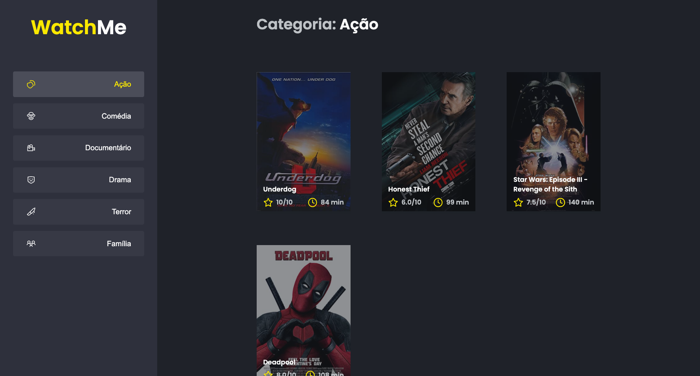

<h1 align="center">
  WactMe
</h1>

<h1 align="center">
  
</h1>

## 💬  Sobre
Este é um projeto bem simples de uma categoria de filmes.

## 🎯 Objetivo
Componentizar algumas partes do código a fim de estruturar melhor a aplicação.

## 🧐 Aprendizado
Como quebrar o código em diversas partes para poder reutilizar depois, fazendo assim a famosa componentização.

## 👨🏻‍🚀 Me acompanhe no Linkedin também:
<a href="https://www.linkedin.com/in/gabriel-mendonca-pereira/">
 
 
Gabriel Mendonça Pereira

</a>
